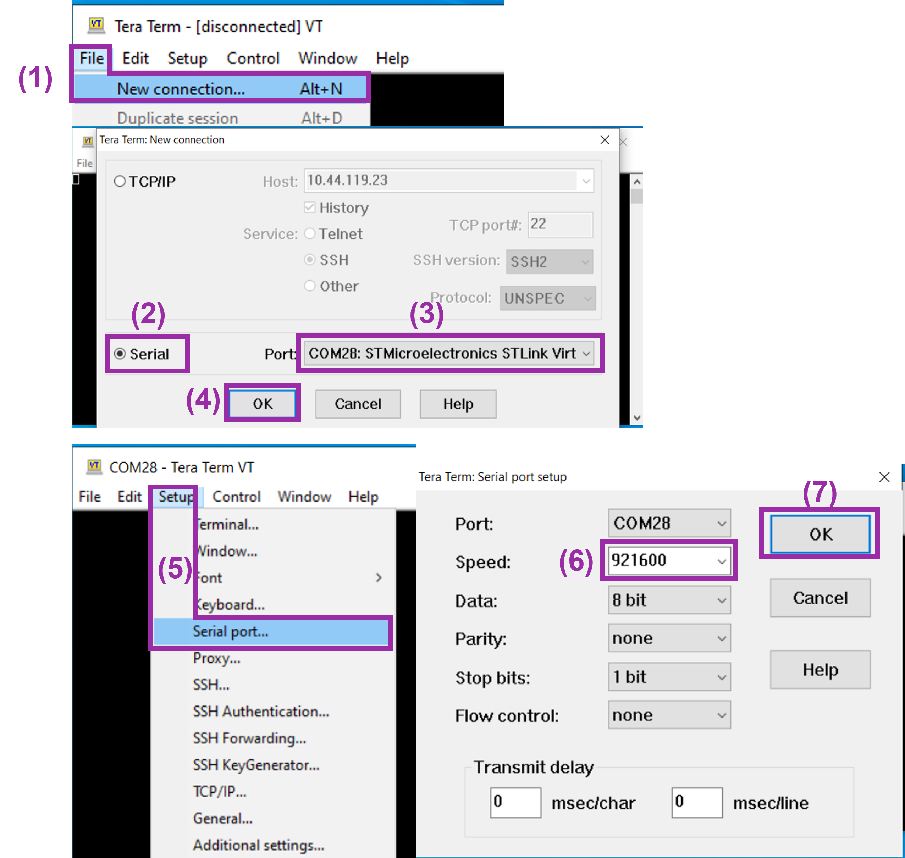
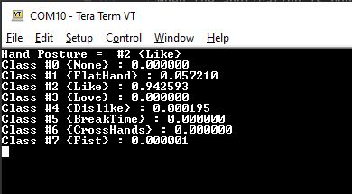

# Hand Posture STM32 Model Deployment

This tutorial demonstrates how to deploy a pre-trained Hand Posture model built with Keras (.h5) on an STM32 board using STM32Cube.AI.


<details open><summary><a href="#1"><b>1. Before You Start</b></a></summary><a id="1"></a>
<ul><details open><summary><a href="#1-1">1.1 Hardware Setup</a></summary><a id="1-1"></a>

The [stm32ai application code](../../application_code/hand_posture/STM32F4/README.md) runs on a hardware setup consisting of an STM32 microcontroller board connected to an ST ToF board. This version supports the following boards only:

- [NUCLEO-F401RE](https://www.st.com/en/evaluation-tools/nucleo-f401re.html) Nucleo board
- [X-NUCLEO-53LxA1](https://www.st.com/en/ecosystems/x-nucleo-53l8a1.html) Nucleo expansion board

</details></ul>
<ul><details open><summary><a href="#1-2">1.2 Software Requirements</a></summary><a id="1-2"></a>

You can use the [STM32 developer cloud](https://stedgeai-dc.st.com/home) to access the STM32Cube.AI functionalities without installing the software. This requires an internet connection and creating a free account. Alternatively, you can install [STM32Cube.AI](https://www.st.com/en/embedded-software/x-cube-ai.html) locally. In addition to this, you will also need to install [STM32CubeIDE](https://www.st.com/en/development-tools/stm32cubeide.html) for building the embedded project.

For local installation :

- Download and install [STM32CubeIDE](https://www.st.com/en/development-tools/stm32cubeide.html).
- If opting to use [STM32Cube.AI](https://www.st.com/en/embedded-software/x-cube-ai.html) locally, download it then extract both `.zip` and `.pack` files.

Detailed instructions on installation are available in this [wiki article](https://wiki.st.com/stm32mcu/index.php?title=AI:How_to_install_STM32_model_zoo).

</details></ul>
<ul><details open><summary><a href="#1-3">1.3 Specifications</a></summary><a id="1-3"></a>

- `serie`: STM32F4
- `IDE`: GCC

</details></ul>
</details>
<details open><summary><a href="#2"><b>2. Configure the YAML File</b></a></summary><a id="2"></a>

You can use the deployment service by using a model zoo pre-trained model from the [STM32 model zoo on GH](../pretrained_models/README.md) or your own Hand Posture model. Please refer to the YAML file [deployment_config.yaml](../src/config_file_examples/deployment_config.yaml), which is a ready YAML file with all the necessary sections ready to be filled, or you can update the [user_config.yaml](../user_config.yaml) to use it.

As an example, we will show how to deploy the model [CNN2D_ST_HandPosture_8classes.h5](https://github.com/STMicroelectronics/stm32ai-modelzoo/tree/master/hand_posture/CNN2D_ST_HandPosture/ST_pretrainedmodel_custom_dataset/ST_VL53L8CX_handposture_dataset/CNN2D_ST_HandPosture_8classes/) pre-trained on the [ST_VL53L8CX_handposture_dataset](../datasets/README.md) dataset .

<ul><details open><summary><a href="#2-1">2.1 Setting the Model and the Operation Mode</a></summary><a id="2-1"></a>

The first section of the configuration file is the `general` section that provides information about your project and the path to the model you want to deploy. The `operation_mode` attribute should be set to `deployment` as follows:

```yaml
general:
   model_path: ../../stm32ai-modelzoo/hand_posture/CNN2D_ST_HandPosture/ST_pretrainedmodel_custom_dataset/ST_VL53L8CX_handposture_dataset/CNN2D_ST_HandPosture_8classes/CNN2D_ST_HandPosture_8classes.h5
    # Path to the model file to deploy

operation_mode: deployment
```

In the `general` section, users must provide the path to their model file using the `model_path` attribute. It has to be a Keras model file with a `.h5` filename extension (float model).

You must copy the `preprocessing` section to your own configuration file to ensure you have the correct preprocessing parameters.

</details></ul>
<ul><details open><summary><a href="#2-2">2.2 Dataset Configuration</a></summary><a id="2-2"></a>

Configure the **dataset** section in the YAML file as follows:

```yaml
dataset:
   class_names: [None, Like, Dislike, FlatHand, Fist, Love, BreakTime, CrossHands]
```
The `class_names` attribute specifies the classes that the model is trained on. This information must be provided in the YAML file, as there is no dataset from which the classes can be inferred.

</details></ul>
<ul><details open><summary><a href="#2-3">2.3 Deployment parameters</a></summary><a id="2-3"></a>

To deploy the model on the **NUCLEO-F401RE** board, we will use *STM32Cube.AI* to convert the model into optimized C code and *STM32CubeIDE* to build the C application and flash the board.

These steps will be done automatically by configuring the **tools** and **deployment** sections in the YAML file as follows:

```yaml
tools:
   stedgeai:
      version: 10.0.0
      optimization: balanced
      on_cloud: True
      path_to_stedgeai: C:/Users/<XXXXX>/STM32Cube/Repository/Packs/STMicroelectronics/X-CUBE-AI/<*.*.*>/Utilities/windows/stedgeai.exe
   path_to_cubeIDE: C:/ST/STM32CubeIDE_1.17.0/STM32CubeIDE/stm32cubeide.exe

deployment:
   c_project_path: ../application_code/hand_posture/STM32F4/
   IDE: GCC
   verbosity: 1
   hardware_setup:
      serie: STM32F4
      board: NUCLEO-F401RE
```

where:
- `version` - Specify the **STM32Cube.AI** version used to benchmark the model, e.g., **10.0.0**.
- `optimization` - *String*, define the optimization used to generate the C model, options: "*balanced*", "*time*", "*ram*".
- `path_to_stedgeai` - *Path* to stedgeai executable file to use local download, else **False**.
- `path_to_cubeIDE` - *Path* to stm32cubeide executable file.
- `c_project_path` - *Path* to [stm32ai application code](../../application_code/hand_posture/STM32F4/README.md) project.
- `IDE` - **GCC**, only supported option for *stm32ai application code*.
- `verbosity` - *0* or *1*. Mode 0 is silent, and mode 1 displays messages when building and flashing the C application on the STM32 target.
- `serie` - **STM32F4**, only supported option for *stm32ai application code*.
- `board` - **NUCLEO-F401RE**, the board name.

</details></ul>
<ul><details open><summary><a href="#2-4">2.4 Configuring the mlflow section</a></summary><a id="2-4"></a>

The model zoo uses MLFlow to record logs when running. You'll want to configure the `mlflow` section of your configuration file like in the example below:

```yaml
mlflow:
  uri: ./src/experiments_outputs/mlruns
```

You'll then be able to access the logs by going to `src/experiments_outputs` in your favorite shell, using the command `mlflow ui`, and accessing the provided IP address in your browser.

</details></ul>
</details>
<details open><summary><a href="#3"><b>3. Deploy pretrained model on STM32 board</b></a></summary><a id="3"></a>

First, you need to connect the ST multi-zone Time-of-Flight daughter board [*P-NUCLEO-53L8A1*](https://www.st.com/en/ecosystems/p-nucleo-53l8a1) to the [*NUCLEO-F401RE*](https://www.st.com/en/evaluation-tools/nucleo-f401re) board, then connect the Nucleo board to your computer using a USB cable.

The picture below shows the complete setup:


If you chose to modify the [user_config.yaml](../user_config.yaml), you can deploy the model by running the following command from the UC folder to build and flash the application on your board:

```bash
python stm32ai_main.py 
```

If you chose to update the [deployment_config.yaml](../src/config_file_examples/deployment_config.yaml) and use it, then run the following command from the UC  folder to build and flash the application on your board:

```bash
python stm32ai_main.py --config-path ./src/config_file_examples/ --config-name deployment_config.yaml
```

</details>
<details open><summary><a href="#4"><b>4. Run the application in the Gesture EVK GUI</b></a></summary><a id="4"></a>

When the application is running on the *NUCLEO-F401RE* Nucleo board, it can be tested with the ST User Interface: STSW-IMG035_EVK (Gesture EVK).
This tool can be downloaded on [ST.com](https://www.st.com/en/embedded-software/stsw-img035.html).

The implementation and the dataset are done with the following sensor orientation:


There are two ways to visualize the Hand Posture Model outputs:

Below are the different steps to open the dedicated Hand Posture widget to visualize the output of your application.


A dedicated User Manual is available in this software STSW-IMG035_EVK (Gesture EVK).

</details>
<details open><summary><a href="#5"><b>5. Run the application in a serial terminal</b></a></summary><a id="5"></a>

Once programmed, the board can be connected through a serial terminal, and the output of the inference can be seen in the serial terminal. 
To connect the serial port, please follow the steps shown in the figure below:


To run the application, use the command line "enable" and press enter.


The Tera Term terminal shows the output of one inference from the live data.



</details>
