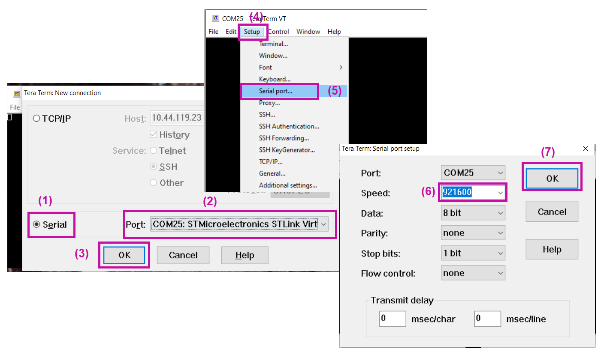
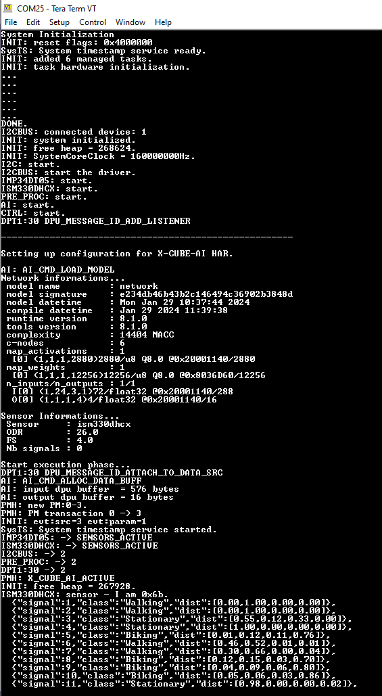

# Human Activity Recognition STM32 model deployment

This tutorial shows how to deploy your pre-trained Keras models (.h5) on an STM32 board using *STM32Cube.AI*. 

In addition, this tutorial will also explain how to deploy a model from the **[ST public model zoo](../pretrained_models/README.md)** directly on your *STM32 target board*. In this version, only deployment on the [B-U585I-IOT02A](https://www.st.com/en/evaluation-tools/b-u585i-iot02a.html) is supported.

We strongly recommend following the [training tutorial](../src/training/README.md) first.


<details open><summary><a href="#1"><b>1. Before you start</b></a></summary><a id="1"></a>

Please check out [STM32 model zoo](../pretrained_models/README.md) for pretrained models' accuracies and performance results.

<ul><details open><summary><a href="#1-1">1.1 Hardware setup</a></summary><a id="1-1"></a>

The [STM32 C application](../../application_code/sensing_thread_x/STM32U5/README.md) is running on an STMicroelectronics evaluation kit board called [B-U585I-IOT02A](https://www.st.com/en/evaluation-tools/b-u585i-iot02a.html). The current version of the application code only supports this board and the usage of the ISM330DHCX accelerometer.

</details></ul>
<ul><details open><summary><a href="#1-2">1.2 Software requirements</a></summary><a id="1-2"></a>

You can use the [STM32 developer cloud](https://stedgeai-dc.st.com/home) to access the STM32Cube.AI functionalities without installing the software. This requires an internet connection and creating a free account. Alternatively, you can install [STM32Cube.AI](https://www.st.com/en/embedded-software/x-cube-ai.html) locally. In addition to this, you will also need to install [STM32CubeIDE](https://www.st.com/en/development-tools/stm32cubeide.html) for building the embedded project.

For local installation :

- Download and install [STM32CubeIDE](https://www.st.com/en/development-tools/stm32cubeide.html).
- If opting for using [STM32Cube.AI](https://www.st.com/en/embedded-software/x-cube-ai.html) locally, download it then extract both `'.zip'` and `'.pack'` files.
The detailed instructions on installation are available in this [wiki article](https://wiki.st.com/stm32mcu/index.php?title=AI:How_to_install_STM32_model_zoo).

</details></ul>
<ul><details open><summary><a href="#1-3">1.3 Specifications</a></summary><a id="1-3"></a>

- `serie`: STM32U5
- `board`: B-U585I-IOT02A
- `IDE`: GCC

</details></ul>
</details>
<details open><summary><a href="#2"><b>2. YAML file configuration</b></a></summary><a id="2"></a>

The deployment of the model is driven by a configuration file written in the YAML language. This configuration file is called [user_config.yaml](../user_config.yaml) and is located in the Use Case directory.

This tutorial only describes enough settings for you to be able to deploy a pretrained model from the model zoo. Please refer to the [human_activity_recognition/README.md](../src/README.md) file for more information on the configuration file.

In this tutorial, we will be deploying a pretrained model from the STM32 model zoo.
Pretrained models can be found under the [model zoo on GH](https://github.com/STMicroelectronics/stm32ai-modelzoo/tree/master/human_activity_recognition/) folder. Each of the pretrained models has its own subfolder. These subfolders contain a copy of the configuration file used to train this model. Copy the `preprocessing` section from the given model to your own configuration file [user_config.yaml](../user_config.yaml), to ensure you have the correct preprocessing parameters for the given model.

In this tutorial, we will deploy an [ign_wl_24.h5](https://github.com/STMicroelectronics/stm32ai-modelzoo/blob/master/human_activity_recognition/ign/ST_pretrainedmodel_custom_dataset/mobility_v1/ign_wl_24/ign_wl_24.h5) that has been trained on mobility_v1, a proprietary dataset collected by STMicroelectronics.

<ul><details open><summary><a href="#2-1">2.1 Operation mode</a></summary><a id="2-1"></a>

Executing `stm32ai_main.py` file runs different services. The `operation_mode` attribute of the configuration file lets you choose which service of the model zoo you want to use. The possible choices are:
- `benchmarking`
- `deployment`
- `evaluation`
- `training`
- `chain_tb` (chaining train and benchmarking)
Refer to section 3.2 of the [main README](../src/README.md) for more details.

For the deployment, you just need to set `operation_mode` to `"deployment"`, like below: 

```yaml
operation_mode: deployment
```
The settings for the other attributes are described in sections below.

</details></ul>
<ul><details open><summary><a href="#2-2">2.2 General settings</a></summary><a id="2-2"></a>

The first section of the configuration file is the `general` section that provides information about your project.

Critically, you must set the `model_path` attribute to the path of the model you wish to deploy, like in this example: 

```yaml
general:
   project_name: human_activity_recognition           # Project name. Optional, defaults to "<unnamed>".
   logs_dir: logs                    # Name of the directory where log files are saved. Optional, defaults to "logs".
   saved_models_dir: saved_models    # Name of the directory where model files are saved. Optional, defaults to "saved_models".
   model_path: ../../stm32ai-modelzoo/human_activity_recognition/ign/ST_pretrainedmodel_custom_dataset/mobility_v1/ign_wl_24/ign_wl_24.h5         # Path to the model you want to deploy
   global_seed: 123                  # Seed used to seed random generators (an integer). Optional, defaults to 123.
   deterministic_ops: False          # Enable/disable deterministic operations (a boolean). Optional, defaults to False.
   display_figures: True             # Enable/disable the display of figures (training learning curves and confusion matrices).
                                     # Optional, defaults to True.
   gpu_memory_limit: 5               # Maximum amount of GPU memory in GBytes that TensorFlow may use (an integer).
```

</details></ul>
<ul><details open><summary><a href="#2-3">2.3 Dataset specification</a></summary><a id="2-3"></a>

Information about the dataset you want to use (or used for training the model) is provided in the `dataset` section of the configuration file, as shown in the YAML code below.

```yaml
dataset:
  name: mobility_v1 # Name of the dataset. 
                    # Use 'mobility_v1' for pretrained models trained on the custom datasets provided in pretrained_models
                    # Use 'WISDM' for pretrained models trained on the public datasets provided in pretrained_models
  class_names: [Stationary, Walking, Jogging, Biking] # Names of the classes your model was trained on
                                                     # Must be included when deploying as well in the exact same order.
  training_path: ./datasets/mobility_v1/test.pkl    # Not mandatory for deployment
  
  validation_path: # Optional
  validation_split: 0.2  # Optional, float value between 0 and 1, default value is 0.2

  test_path: # Optional
  test_split: 0.25  # Optional, float value between 0 and 1, default value is 0.25

  seed: 123 # Optional, an integer value, there is a default seed 123
```

When deploying, you don't need to provide paths to any dataset. However, you do need to provide the `class_names` used during training. Beware, that the class names should be the very same and in the same order as provided here. If you deploy a model trained outside the zoo, this may cause the displayed classes on the board to be wrong.

For more details on this section, please consult section 3.5 and section 6 of the [main README](../src/README.md).

</details></ul>
<ul><details open><summary><a href="#2-4">2.4 Data Preparation and Preprocessing</a></summary><a id="2-4"></a>

When performing Human Activity Recognition, the data is not processed sample by sample; rather, the data is first framed using different lengths depending on how often a prediction is to be made. In this operation, we are using a model which used a framing of length 24, as suggested by the name: [ign_wl_24.h5](https://github.com/STMicroelectronics/stm32ai-modelzoo/blob/master/human_activity_recognition/ign/ST_pretrainedmodel_custom_dataset/mobility_v1/ign_wl_24/ign_wl_24.h5), `wl` stands for window length. The first step of the data preparation is to do the framing of the samples. This information is provided in the section `training.model` as shown below while training:
```yaml
training:
  model:
    name: ign
    input_shape: (24, 3, 1)
```
During the deployment, if this information is not provided here, it is inferred from the model shape from the model file provided in `general.model` file.

The next step is to set the preprocessing options. In this version, we provide two preprocessing methods, namely:
- gravity rotation and suppression: This rotates the sample in a way that the gravity is always pointing to the z-axis and then applies a high pass filter to remove the constant part of the frames.
- normalization: this normalizes the frames by applying standard normalization, i.e., subtracts the mean (to make frames zero mean) and divides the frames by the standard deviation.
These preprocessing methods can be applied by enabling the flags associated with them.

```yaml
preprocessing:
  gravity_rot_sup: True
  normalization: False
```
The pretrained models are only trained by applying the `gravity_rot_sup` only. 

**NOTE**: It is important to choose the same preprocessing and data preparation settings for the deployment as were used for training to have expected results.

</details></ul>
<ul><details open><summary><a href="#2-5">2.5 Configuring the tools section</a></summary><a id="2-5"></a>

Next, you'll want to configure the `tools` section in your configuration file. This section covers the usage of the STM32-X-CUBEAI tool, which benchmarks .tflite and .h5 models, and converts them to C code.

To convert your model to C code, you can either use the [STM32 developer cloud](https://stedgeai-dc.st.com/home) (requires making an account), or use the local versions of CubeAI and CubeIDE you installed earlier in the tutorial.

If you wish to use the [STM32 developer cloud](https://stedgeai-dc.st.com/home), simply set the `on_cloud` attribute to True, like in the example below. If using the developer cloud, you do not need to specify paths to STM32CubeAI or CubeIDE.

```yaml
tools:
  stedgeai:
    version: 10.0.0
    optimization: balanced
    on_cloud: True
    path_to_stedgeai: C:/Users/<XXXXX>/STM32Cube/Repository/Packs/STMicroelectronics/X-CUBE-AI/<*.*.*>/Utilities/windows/stedgeai.exe
  path_to_cubeIDE: C:/ST/STM32CubeIDE_1.17.0/STM32CubeIDE/stm32cubeide.exe
```

For more details on what each parameter does, please refer to section 3.14 of the [main README](../src/README.md).

</details></ul>
<ul><details open><summary><a href="#2-6">2.6 Configuring the deployment section</a></summary><a id="2-6"></a>

Finally, you need to configure the `deployment` section of your configuration file, like in the example below.

```yaml
deployment:
  c_project_path: ../application_code/sensing_thread_x/STM32U5/
  IDE: GCC
  verbosity: 1
  hardware_setup:
    serie: STM32U5
    board: B-U585I-IOT02A
```

You only need to specify the path to one of these applications in `c_project_path`.
Currently, the C application only supports the `B-U585I-IOT02A` board. So all the rest of the components should be as they are here.

The `c_project_path` has all the necessary code for the deployment of the human activity recognition model on your `B-U585I-IOT02A` board. All that is missing will be generated by launching the `stm32ai_main.py` file with the configuration file that you are preparing following this document.

</details></ul>
<ul><details open><summary><a href="#2-7">2.7 Configuring the mlflow section</a></summary><a id="2-7"></a>

The model zoo uses MLFlow to record logs when running. You'll want to configure the `mlflow` section of your configuration file like in the example below:

```yaml
mlflow:
  uri: ./experiments_outputs/mlruns
```
You'll then be able to access the logs by going to `src/experiments_outputs` in your favorite shell, using the command `mlflow ui`, and accessing the provided IP address in your browser.

</details></ul>
</details>
<details open><summary><a href="#3"><b>3. Running deployment</b></a></summary><a id="3"></a>
<ul><details open><summary><a href="#3-1">3.1 Attach the board</a></summary><a id="3-1"></a>

To run the deployment, which will build the project and flash the built binary file to the target board, connect a B-U585I-IOT02A to your computer using the microUSB port on the board.

</details></ul>
<ul><details open><summary><a href="#3-2">3.2 Run stm32ai_main.py</a></summary><a id="3-2"></a>

Make sure that you have configured your configuration file properly as explained in the sections below, then, navigate to [human_activity_recognition/](../) folder.
Do a final check to verify that you have properly set `operation_mode` to `deployment`, and paths to the tools are properly set also, then launch the following command in the command prompt:

```bash
python stm32ai_main.py
```

This will take care of everything. It will optimize your neural network for STM32MCU targets, generate the C code for the neural networks, copy the generated c-model files in the stm32ai application C project, build the C project, and flash the board.

</details></ul>
</details>
<details open><summary><a href="#4"><b>4. See the results on the board</b></a></summary><a id="4"></a>

Once flashed, a serial terminal can be used to check what is happening on the board and the output of the inference can be seen in the serial terminal. 
To connect the serial port, please follow the steps shown in the figure below:


After a successful connection, perform a reset using the [RESET] button on the board. This will reset the board and print the information about the flashed project. It will print the settings used for the sensors, the build time of the binary, and then it starts printing the inference results.



Once the inference is started, each line in the TeraTerm terminal shows the output of one inference from the live data.
Inference is run almost once a second if a model with wl_24 is used and once every two seconds if wl_48 models are used.
The labels `"signal"` show the signal index or number, the `"class"` has the label of the class detected, and `"dist"` shows the probability distribution or the confidence of the signal to belong to any given class, with classes provided in the deployment configuration.

</details>
<details open><summary><a href="#5"><b>5. Restrictions</b></a></summary><a id="5"></a>

- In the current version, application code for deployment is only supported on the [B-U585I-IOT02A](https://www.st.com/en/evaluation-tools/steval-stwinkt1b.html).

</details>
