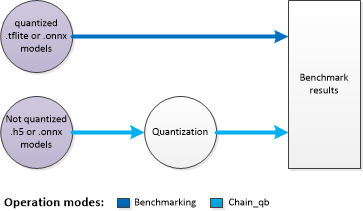

# How can I quickly benchmark a model using the ST Model Zoo?

With ST Model Zoo, you can easily evaluate the memory footprints and inference time of a model on multiple hardwares using the [ST Edge AI Development Cloud](https://stm32ai.st.com/st-edge-ai-developer-cloud/)

## Operation modes:

Depending on the model format you have, you can use the operation modes below:
- Benchmarking:
    - To benchmark a quantized model (.tflite or QDQ onnx)
- Chain_qb:
    - To quantize and benchmark a float model (.h5 or .onnx) in one pass
<div align="left" style="width:100%; margin: auto;">


</div>

For any details regarding the parameters of the config file, you can look here:
- [Quantization documentation](../../../src/quantization/README.md)
- [Benchmark documentation](../../../src/benchmarking/README.md)

## Available boards for benchmark:

'STM32N6570-DK', 'STM32H747I-DISCO', 'STM32H7B3I-DK', 'STM32H573I-DK', 'NUCLEO-H743ZI2', 'STM32F769I-DISCO', 'STM32H735G-DK', 'STM32H7S78-DK', 'STM32F469I-DISCO', 'STM32F746G-DISCO', 'B-U585I-IOT02A', 'STM32L4R9I-DISCO', 'NUCLEO-F401RE', 'NUCLEO-G474RE', 'STM32MP257F-EV1', 'STM32MP135F-DK' and 'STM32MP157F-DK2'

## User_config.yaml:

The way ST Model Zoo works is that you edit the user_config.yaml available for each use case and run the stm32ai_main.py python script. 

Here is an example where we quantize a .h5 model from model zoo, before benchmarking it.
For only the benchmmarking operation mode, you can delete the parts not needed if you want.

The most important parts here are to define:
- The path to the model and its type
- The operation mode to benchmarking or chain_qb
- The benchmarking parameters (online or locally, see below)
- The benchmarking hardware target
- the quantization options if you use it

```yaml
# user_config.yaml

general:
  # path to the model to benchmark
  model_path: ../../stm32ai-modelzoo/object_detection/st_ssd_mobilenet_v1/ST_pretrainedmodel_public_dataset/coco_2017_person/st_ssd_mobilenet_v1_025_256/st_ssd_mobilenet_v1_025_256.h5
  model_type: st_ssd_mobilenet_v1

operation_mode: chain_qb

# preprocessing used during training
preprocessing:
  rescaling: { scale: 1/127.5, offset: -1 }
  resizing:
    interpolation: nearest
    aspect_ratio: fit
  color_mode: rgb

# Optionnal
postprocessing:
  confidence_thresh: 0.6
  NMS_thresh: 0.5
  IoU_eval_thresh: 0.3
  plot_metrics: True   # Plot precision versus recall curves. Default is False.
  max_detection_boxes: 10

# NEeded if quantization in the operation mode
quantization:
  quantizer: TFlite_converter
  quantization_type: PTQ
  quantization_input_type: uint8
  quantization_output_type: float
  granularity: per_channel  # Optional, defaults to "per_channel".
  optimize: False           # Optional, defaults to False.
  target_opset: 17          # Optional, defaults to 17 if not provided. Only used for when using Onnx_quantizer
  export_dir: quantized_models

tools:
  stedgeai:
    version: 10.0.0
    optimization: balanced
    on_cloud: True # ST Edge AI Cloud or locally with ST Edge AI
    path_to_stedgeai: C:/Users/<XXXXX>/STM32Cube/Repository/Packs/STMicroelectronics/X-CUBE-AI/<*.*.*>/Utilities/windows/stedgeai.exe
  path_to_cubeIDE: C:/ST/STM32CubeIDE_<*.*.*>/STM32CubeIDE/stm32cubeide.exe

# the hardware used for the benchmark
benchmarking:
  board: STM32H747I-DISCO

mlflow:
  uri: ./src/experiments_outputs/mlruns

hydra:
  run:
    dir: ./src/experiments_outputs/${now:%Y_%m_%d_%H_%M_%S}
  
```
Here the quantization is made with random data as no data were provided and main goal was to have a quick insight on the performances of a quantized model for a specific HW. When evaluating the model, it is highly recommended to use real data for the final quantization of course.

### Local benchmarking:

To make the benchmark locally instead of using the ST Edge AI Development Cloud you need to add the path for path_to_stedgeai and to set on_cloud to false in the yaml.
- [ST Edge AI](https://www.st.com/en/embedded-software/x-cube-ai.html)
- [STM32CubeIDE](https://www.st.com/en/development-tools/stm32cubeide.html)

## Run the script:

Edit the user_config.yaml then open a CMD (make sure to be in the UC folder). Finally, run the command:

```powershell
python stm32ai_main.py
```
You can also use any .yaml file using command below:
```powershell
python stm32ai_main.py --config-path=path_to_the_folder_of_the_yaml --config-name=name_of_your_yaml_file
```